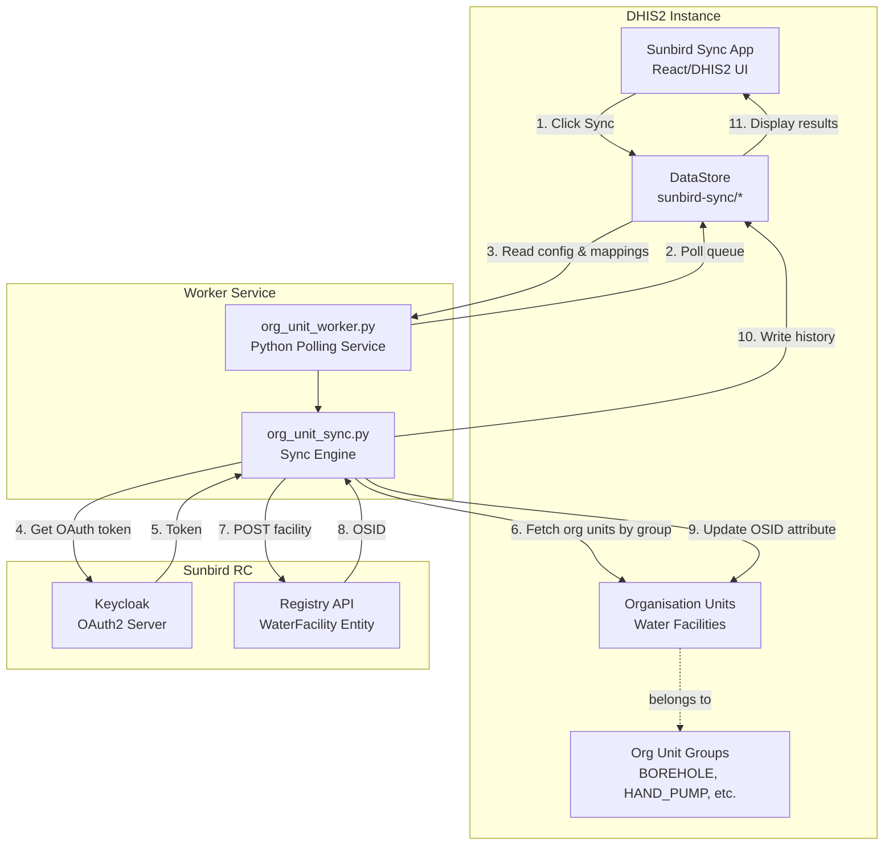
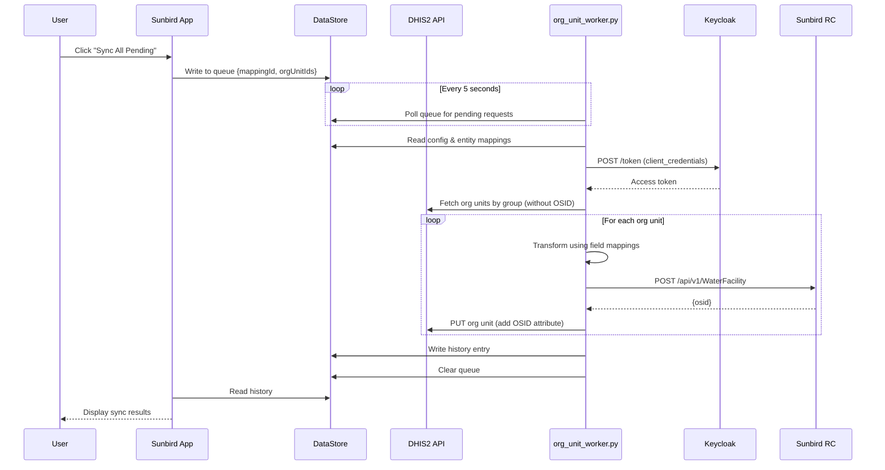
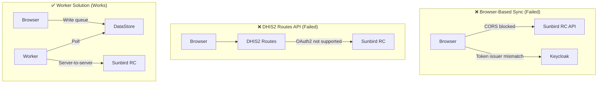

# DHIS2-Sunbird RC Integration Brief

## Purpose

This project integrates **DHIS2** (District Health Information Software 2) with **Sunbird RC** (Registry & Credentialing) to create a **Water Facility Registry** for Liberia.

- **DHIS2**: Serves as the primary data entry and management system for water facility registration (Organisation Units)
- **Sunbird RC**: Acts as a verifiable credential registry that provides a permanent, immutable record of registered facilities

The goal is to sync water facility data from DHIS2 to Sunbird RC, enabling facilities to receive a verifiable registry ID (OSID).

### Data Model

Facilities are modeled as **Organisation Units** with:
- **Org Unit Groups**: Categorize facility types (BOREHOLE, HAND_PUMP, PROTECTED_WELL, etc.)
- **Geometry**: Native point coordinates for location
- **SUNBIRD_OSID Attribute**: Stores the Sunbird RC registry ID after sync

---

## Architecture Overview



---

## Data Flow



---

## Why a Worker? The CORS/OAuth Journey

### The Problem

We initially tried to sync directly from the browser (DHIS2 React app → Sunbird RC), but hit multiple blockers:



### Issue #1: CORS & Token Issuer Mismatch

1. **CORS**: Browser requests to Sunbird RC were blocked. Fixed by configuring nginx headers.

2. **Token Issuer Mismatch**: Even after fixing CORS, the OAuth tokens failed validation:
   - Browser gets tokens from: `http://localhost/auth/realms/sunbird-rc`
   - Sunbird RC validates against: `http://keycloak:8080/auth/realms/sunbird-rc` (Docker internal)
   - Result: **401 Unauthorized** - issuers don't match

### Issue #2: DHIS2 Routes API Limitation

We tried using DHIS2's Routes API (proxies external calls through DHIS2 backend), but:

```
"Could not resolve type id 'oauth2-client-credentials' as a subtype of AuthScheme"
```

**DHIS2 Routes only supports**: `http-basic`, `api-token`, `api-headers`, `api-query-params`

**Sunbird RC requires**: OAuth2 client credentials flow ❌

### Solution: Background Worker

A Python worker service that:
- Runs alongside DHIS2 (same Docker network)
- Polls DHIS2 DataStore for sync requests
- Performs server-to-server OAuth2 authentication (no browser involved)
- Updates org units and writes results back to DataStore

---

## Development Journey Summary

### Phase 1: Initial TEI-Based Approach

Started with **Tracked Entity Instances (TEIs)** as water facilities:

- Created Water Facility program with tracked entity type
- Attributes: facilityName, waterPointType, extractionType, location, etc.
- `syncStatus` attribute to track pending/synced state

**Challenge**: DHIS2's TEI model is designed for tracking people (patients, students), not infrastructure assets. The workflow felt awkward for facility registration.

### Phase 2: Browser-Based Sync Attempts

Tried direct browser → Sunbird RC sync:

| Attempt | Problem |
|---------|---------|
| Direct API call | CORS blocked by Sunbird RC |
| Added nginx CORS headers | OAuth token issuer mismatch (localhost vs keycloak:8080) |
| DHIS2 Routes API proxy | Routes API doesn't support OAuth2 client credentials |

**Result**: Browser-based sync not viable due to OAuth2 token issuer validation.

### Phase 3: Worker Solution

Implemented Python background worker:

- Runs server-side (same Docker network as Keycloak/Sunbird)
- Polls DataStore queue for sync requests
- Server-to-server OAuth2 works (no issuer mismatch)
- Updates DHIS2 with OSID after successful sync

**This solved the CORS/OAuth problem.**

### Phase 4: Architecture Pivot - TEI → Organisation Units

**Key Realization**: Water facilities are better modeled as **Organisation Units**, not TEIs.

| Aspect | TEI Approach | Org Unit Approach |
|--------|--------------|-------------------|
| Data Model | Tracked Entity + Program | Organisation Unit + Groups |
| Hierarchy | Flat (enrolled in program) | Natural tree (Country → County → District → Facility) |
| Facility Types | Option set attribute | Org Unit Groups (BOREHOLE, HAND_PUMP, etc.) |
| Location | TEI attribute | Native geometry support |
| DHIS2 Fit | Awkward (designed for people) | Natural (designed for facilities) |

**Changes Made**:
1. Deleted TEI-based sync code (`sync.py`, `worker.py`)
2. Created org unit sync (`org_unit_sync.py`, `org_unit_worker.py`)
3. Added `SUNBIRD_OSID` org unit attribute
4. Created org unit groups for facility types
5. Updated app to use entity mappings (org unit groups → Sunbird entity)

### Phase 5: Current Architecture

```
DHIS2 Organisation Units (Facilities)
        ↓
   Org Unit Groups (BOREHOLE, HAND_PUMP, etc.)
        ↓
   Entity Mappings (group → Sunbird entity type)
        ↓
   Worker polls DataStore queue
        ↓
   Sync to Sunbird RC (OAuth2 client credentials)
        ↓
   Update org unit with OSID attribute
```

### Key Decisions Made

| Decision | Reason |
|----------|--------|
| **TEI → Org Units** | Better data model fit for infrastructure assets |
| **Browser → Worker** | OAuth2 token issuer mismatch in browser |
| **DataStore as queue** | Decouples UI from sync processing |
| **Org Unit Groups** | Natural way to categorize facility types |
| **OSID attribute** | Tracks which facilities are synced |
| **Entity Mappings** | Flexible mapping from DHIS2 fields to Sunbird schema |

### Issue Tracking

| Issue | Description | Status |
|-------|-------------|--------|
| **#1** | Sunbird Custom App - Implementation | Closed |
| **#5** | Org Unit Architecture Pivot | In Progress |

---

## Current Config Structure

### DataStore: `sunbird-sync/config`

```json
{
  "sunbirdUrl": "http://sunbird-rc:8081/api/v1",
  "keycloakUrl": "http://keycloak:8080/auth/realms/sunbird-rc/protocol/openid-connect/token",
  "clientId": "demo-api",
  "clientSecret": "demo-api-secret-change-me",
  "osidAttributeId": "abc123xyz"
}
```

### DataStore: `sunbird-sync/entity-mappings`

```json
[
  {
    "id": "em-123",
    "entityType": "WaterFacility",
    "orgUnitGroupIds": ["ST3I7msiaGu", "NJylpVluVYv"],
    "fieldMappings": [
      {"source": "name", "target": "facilityName"},
      {"source": "geometry.coordinates[1]", "target": "location.coordinates.lat"},
      {"source": "geometry.coordinates[0]", "target": "location.coordinates.lon"},
      {"source": "parent.name", "target": "location.name"}
    ]
  }
]
```

### DataStore: `sunbird-sync/queue`

```json
[
  {
    "id": "req-456",
    "mappingId": "em-123",
    "orgUnitIds": ["uid1", "uid2"],
    "timestamp": "2024-01-15T10:30:00Z"
  }
]
```

---

## Key Technical Points

1. **DHIS2 Organisation Units**: Water facilities are org units in the hierarchy (Country → County → District → Community → Facility). Each facility has geometry (coordinates) and belongs to org unit groups.

2. **Org Unit Groups**: Categorize facility types - BOREHOLE, HAND_PUMP, PROTECTED_WELL, UNPROTECTED_WELL, PIPED_WATER, SPRING, RAINWATER, SURFACE_WATER.

3. **SUNBIRD_OSID Attribute**: Organisation unit attribute that stores the Sunbird RC registry ID after successful sync. Used to identify which facilities have been synced.

4. **Entity Mappings**: Map org unit groups to Sunbird entity types with field mappings (DHIS2 field → Sunbird field). Supports nested paths like `geometry.coordinates[0]`.

5. **DHIS2 DataStore**: Key-value storage for:
   - `sunbird-sync/config` - Sunbird RC credentials
   - `sunbird-sync/entity-mappings` - Org unit group → Sunbird mappings
   - `sunbird-sync/queue` - Pending sync requests
   - `sunbird-sync/history` - Sync results

6. **Worker Sync Flow**: Worker polls queue, fetches org units without OSID from mapped groups, transforms data using field mappings, POSTs to Sunbird RC, updates org unit with OSID.

7. **DHIS2 API Quirk**: PATCH doesn't support nested objects in `attributeValues`. Must use PUT with full org unit object to update OSID attribute.

---

## Stack

| Component | Technology |
|-----------|------------|
| DHIS2 | Java, PostgreSQL |
| Sunbird App | React, TypeScript, @dhis2/ui, @dhis2/app-runtime |
| Worker | Python 3, requests |
| Sunbird RC | Java, Keycloak, Elasticsearch |
| Infrastructure | Docker Compose |

## CLI Tools

| Command | Description |
|---------|-------------|
| `python -m cli.setup_metadata` | Create org unit groups and OSID attribute |
| `python -m cli.setup_admin_hierarchy --csv FILE` | Import admin hierarchy from CSV |
| `python -m cli.create_facility` | Create single facility |
| `python -m cli.create_random_facilities --count N` | Generate test facilities |
| `python -m cli.import_facilities --csv FILE` | Bulk import facilities |
| `python org_unit_worker.py` | Run sync worker |
